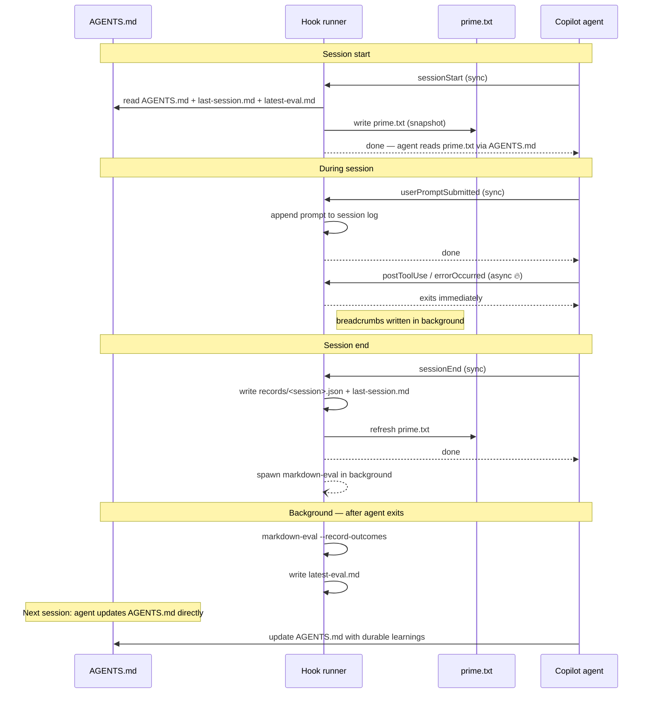

# Copilot markdown-first self-learning hook pack

This branch keeps the hook-based integration model from `main`, but swaps the learning backend from Mulch to plain markdown and `AGENTS.md`.

There is no Mulch dependency on this branch. Durable project memory lives in `AGENTS.md`, while the hook pack records tactical session summaries and local eval output under `.github/hooks/.runtime/`.

## What it does

- primes hook-generated context from `AGENTS.md` and recent runtime summaries at `sessionStart`
- captures prompt and tool breadcrumbs during the session
- writes markdown-backed tactical session records and eval summaries at `sessionEnd`
- keeps durable learnings in `AGENTS.md`

## Template files

- `.github/hooks/markdown-copilot.json` - Copilot hook configuration
- `.github/hooks/markdown-self-learning.mjs` - hook runner for markdown-backed session capture
- `.github/hooks/markdown-eval.mjs` - evaluator for local runtime session records
- `AGENTS.md` - the repo-local instruction and memory file Copilot should read and maintain
- `README.md` - explains how to use the markdown-first approach

## Bootstrap requirements

Before copying these files into a target repository, the user needs to:

1. Ensure Node is available because the hook runner is executed with `node`.
2. Commit `.github/hooks/markdown-copilot.json` so Copilot loads the hook configuration.
3. Commit `AGENTS.md` so Copilot can read the repo-local durable guidance.
4. Seed `AGENTS.md` with the project's key conventions, workflows, and constraints.
5. Decide who is allowed to update it: humans only, agents only, or both through review.

After that, copy `.github/hooks/`, `README.md`, and `AGENTS.md` into the target repository and adapt the sections to your project.

## Notes

- `.github/hooks/.runtime/` is local runtime state and is ignored by git.
- `AGENTS.md` is the durable memory source of truth.
- `prime.txt`, `last-session.md`, record JSON files, and `latest-eval.md` are generated locally by the hook scripts.

## How the loop works



1. `sessionStart` snapshots `AGENTS.md` and recent runtime summaries into `.github/hooks/.runtime/prime.txt`.
2. `userPromptSubmitted` captures prompt breadcrumbs into the current session log. The agent waits for this hook so the log is current before the next tool call.
3. `postToolUse` and `errorOccurred` append tool and error breadcrumbs **fire-and-forget**: stdin is captured into a shell variable, then piped to a backgrounded, disowned node process so the hook returns immediately. The agent does not wait.
4. `sessionEnd` writes a markdown-backed session record into `.github/hooks/.runtime/records/` and refreshes `.github/hooks/.runtime/last-session.md`. The agent waits for this hook so records land before the session is torn down.
5. `sessionEnd` also background-spawns `markdown-eval.mjs --record-outcomes` to score recent records and refresh `.github/hooks/.runtime/latest-eval.md`.
6. Humans or agents promote durable lessons by updating `AGENTS.md` itself.

That gives you a practical cycle of:

`AGENTS.md -> prime.txt -> Copilot reads via AGENTS.md -> work happens -> hooks capture/evaluate -> durable learnings get written back to AGENTS.md`

## Hook design

GitHub hooks run synchronously and block the agent until the hook exits. This pack uses two different patterns depending on whether the hook output matters to the agent:

| Hook | Pattern | Why |
|---|---|---|
| `sessionStart` | Synchronous | Agent must read `prime.txt` before starting work |
| `userPromptSubmitted` | Synchronous | Log must be current before the next action |
| `postToolUse` | Fire-and-forget | Pure logging; agent does not need to wait |
| `errorOccurred` | Fire-and-forget | Pure logging; agent does not need to wait |
| `sessionEnd` | Synchronous | Record and eval must complete before session teardown |

Fire-and-forget hooks use this shell pattern:

```bash
PAYLOAD=$(cat); echo "$PAYLOAD" | node .github/hooks/markdown-self-learning.mjs postToolUse & disown $!
```

`$(cat)` reads stdin completely before the shell backgrounds the process, so the payload is never lost. `disown` removes the child from the shell job table so it survives the shell exiting.

## Persistence model

`.github/hooks/.runtime/` is git-ignored. This means `prime.txt`, `last-session.md`, `latest-eval.md`, and session records are **local to the current working tree** and do not persist across coding agent sessions, which use a fresh checkout each time.

The only durable memory is `AGENTS.md`, which is committed to the repository. This is by design: the loop's job is to surface insights that belong in `AGENTS.md`, not to accumulate an ever-growing log of ephemeral sessions.

If you want session records to persist across coding agent runs, commit them or push them to an external store. For most teams, keeping `AGENTS.md` well-maintained is sufficient.

## Eval loop

By default, the hook pack launches the evaluator in the background at `sessionEnd`. You can also run it manually:

```bash
node .github/hooks/markdown-eval.mjs
node .github/hooks/markdown-eval.mjs --json
node .github/hooks/markdown-eval.mjs --record-outcomes
```

The evaluator uses a deterministic rubric:

- groundedness: changed files and evidence
- reusability: whether the session updated durable `AGENTS.md` guidance
- specificity: prompt/context richness
- validation signal: tool execution and session outcome data

Recommendations:

- `promote` - strong candidate to keep reflected in `AGENTS.md`
- `review` - useful, but still tactical or incomplete
- `discard` - low-signal session summary

## What belongs in `AGENTS.md`

Good candidates:

- coding conventions that apply across the repo
- build, test, and release habits that are easy to forget
- architectural guardrails
- file- or subsystem-specific notes that will likely matter again

Avoid putting these in `AGENTS.md`:

- temporary debugging notes
- one-off task plans
- stale migrations or rollout checklists
- long transcripts of what happened in a single session

## Suggested maintenance pattern

- keep sections short and scannable
- prefer bullets over prose
- record facts, not speculation
- update or delete outdated guidance instead of endlessly appending

If you later need something more automated, you can still layer external tooling on top. This branch keeps the same hook-driven shape as `main`, but makes markdown and `AGENTS.md` the storage layer.
