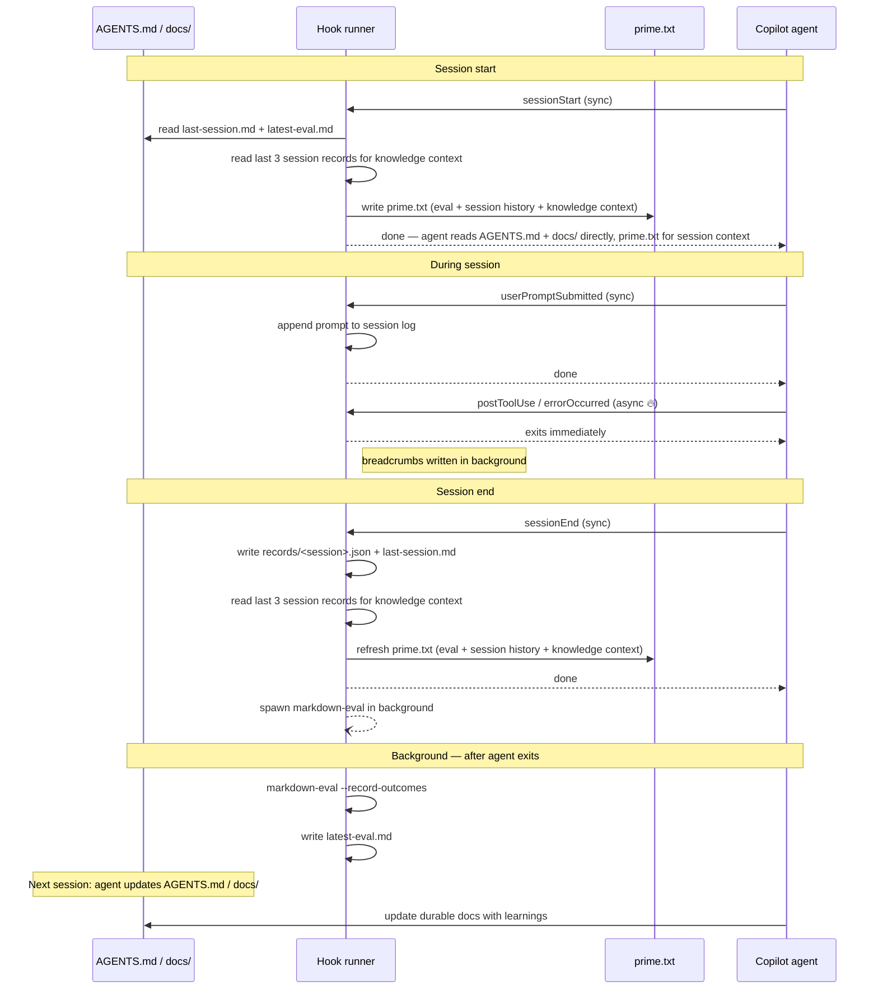

# Hook design

The hook pack ships five hooks. Two patterns are used depending on whether the hook output matters before the agent's next action.

## Hooks and patterns

| Hook | Pattern | Why |
|---|---|---|
| `sessionStart` | Synchronous | Agent must read `prime.txt` before starting work |
| `userPromptSubmitted` | Synchronous | Log must be current before the next action |
| `postToolUse` | Fire-and-forget | Pure logging; agent does not need to wait |
| `errorOccurred` | Fire-and-forget | Pure logging; agent does not need to wait |
| `sessionEnd` | Synchronous | Record and eval must complete before session teardown |

## Fire-and-forget pattern

```bash
PAYLOAD=$(cat); echo "$PAYLOAD" | node .github/hooks/markdown-self-learning.mjs postToolUse & disown $!
```

`$(cat)` reads stdin completely before the shell backgrounds the process, so the payload is never lost. `disown` removes the child from the shell job table so it survives the shell exiting.

## Session flow



## Runtime files

All runtime state lives under `.github/hooks/.runtime/` which is git-ignored:

| File | Purpose |
|---|---|
| `prime.txt` | Refreshed each session; contains latest eval summary + last session handoff |
| `last-session.md` | Most recent session markdown record |
| `latest-eval.md` | Most recent eval report |
| `records/<timestamp>.json` | Per-session JSON records |

Current-session in-progress state is stored in `$TMPDIR/markdown-copilot-hooks/<base64url-of-cwd>/current-session.json` so it survives across hook invocations within the same session without touching the repo.

## Persistence model

`.github/hooks/.runtime/` is git-ignored. This means runtime files are **local to the current working tree** and do not persist across coding agent sessions that use a fresh checkout.

The only durable memory is `AGENTS.md` and files under `docs/`, both committed to the repository. The loop's job is to surface insights that belong there, not to accumulate an ever-growing log of ephemeral sessions.

## Prompt templates

Prompts used by the hook machinery live in `.github/hooks/prompts/`. They are loaded at runtime so they can be edited without touching `.mjs` code.

| File | Used by |
|---|---|
| `promote-learnings.md` | `markdown-eval.mjs` when spawning a promotion via `copilot -p` |

---

## Learning quality features

Three mechanisms improve the signal-to-noise ratio of what gets promoted to durable docs.

### Knowledge type classification

Every session record is automatically classified into one or more knowledge types based on changed files and prompt keywords:

| Type | Triggers |
|---|---|
| `architecture` | Backend source file extensions (`.cs`, `.go`, `.java`, `.py`, `.rs`, etc.) or prompts containing: *architect*, *infrastructure*, *provider*, *database*, *backend* |
| `frontend` | Web UI file extensions (`.tsx`, `.jsx`, `.vue`, `.svelte`, `.css`, `.scss`) |
| `testing` | Test file conventions (`.spec.`, `.test.`, Playwright, Jest, Vitest, Cypress) |
| `infrastructure` | IaC/container files (Docker, `.tf`, `.bicep`, YAML) combined with infra-related terms |
| `workflow` | `docs/`, `AGENTS.md`, `.github/` |
| `decision` | Prompts containing: *migrat*, *chose*, *decided*, *switch*, *because*, *due to* |

All heuristics use file extensions and prompt keywords — no hardcoded directory paths — so they work in any repo without modification.

Types are stored in `record.metadata.knowledgeTypes[]` and added to the record's `tags`. The `prime.txt` handoff file includes a summary of active knowledge areas from recent sessions for broader context.

### Content classifier

Before a session is promoted, a lightweight classifier checks the quality of its prompts. If ≥75% of captured prompts look like questions or meta-talk (phrases like *"what is"*, *"can you"*, *"let me"*, or ending with `?`), the session's eval score is reduced by 1. This prevents exploratory/conversational sessions from being promoted when they contain no actionable guidance.

The penalty is shown in the eval score breakdown:

```
Score: 6/11 (groundedness 2, reusability 1, specificity 1, validation 2, semantic 0, classifier penalty -1)
```

### Jaccard deduplication before synthesis

Before batching review-tier sessions for synthesis, a Jaccard similarity pass removes near-duplicate sessions (threshold: 0.7). When two sessions share >70% of their content tokens, only the higher-scoring one is sent to the synthesis agent. The removed count is logged:

```
Jaccard dedup: removed 1 near-duplicate review session(s) before synthesis.
```

This prevents the synthesis agent from seeing the same topic multiple times, which would dilute its output and waste tokens.

### Superseding guidance

When the promote or synthesise agent updates `AGENTS.md` or `docs/`, it is instructed to remove stale guidance rather than append to it. For significant changes, it notes what was superseded inline: *(supersedes: [old guidance summary])*. This keeps durable docs lean and prevents contradictory guidance from accumulating.
